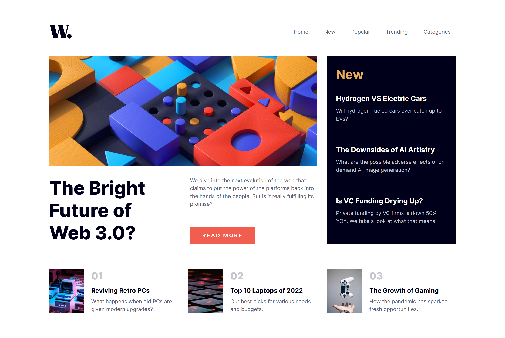

# Frontend Mentor - News Homepage
   
***
Solução para o desafio News Homepage, do site: [Frontend Mentor](https://www.frontendmentor.io/challenges/news-homepage-H6SWTa1MFl).

##  🖥️ Demonstração

## 🔗 Link da página
https://tsb-newshomepage.netlify.app/

## 👨‍💻 Tecnologias Utilizadas
* [ReactJS](https://pt-br.reactjs.org/docs/getting-started.html)
* [Styled-Components](https://styled-components.com/docs)
***
**Desenvolvido por: [Thiago Batista](https://github.com/ThiagoSantosBatista/).**